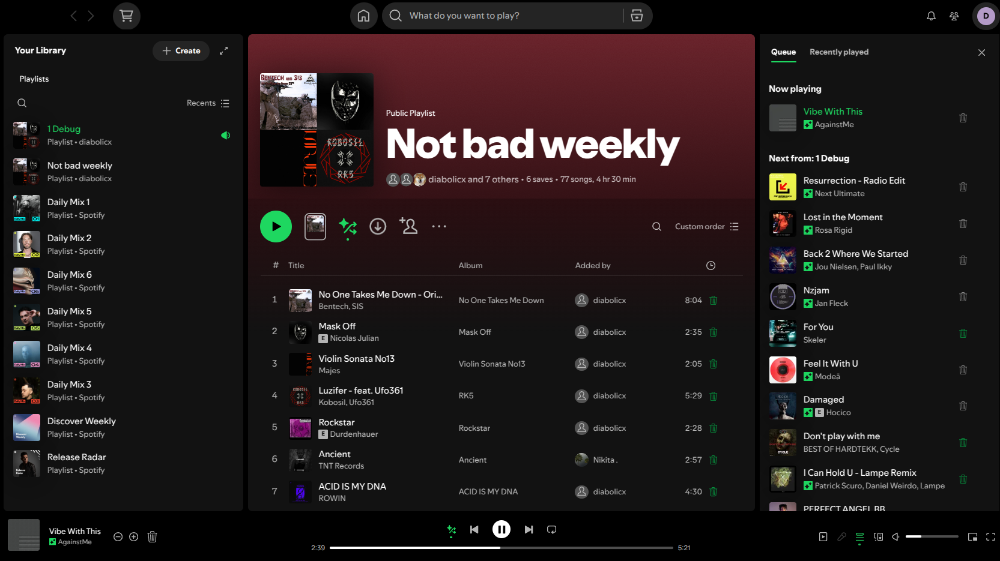
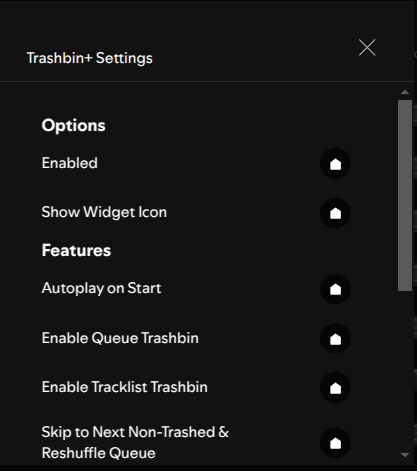

# Trashbin+

A powerful and modern take on the original Trashbin extension for Spicetify. Trash songs and artists you dislike, and they'll be automatically skipped.

## Features

- **Trash Songs and Artists**: Add any song or artist to your trashbin via the context menu (right-click) or a dedicated button in the player.
- **Automatic Skipping**: Trashed items are automatically skipped when they come up in your queue.
- **Reshuffle Queue on Skip**: Optionally, find the next non-trashed track in your queue instead of just skipping to the immediate next song.
- **Integrated UI**: Adds buttons and context menu items seamlessly into the Spotify UI.
- **Settings Menu**: Configure the extension's behavior through the Spicetify profile menu.
- **Backup and Restore**: Easily export and import your trashbin data.

## Issues & Support

Having trouble or found a bug? Please [open an issue](https://github.com/0-don/trashbin-plus/issues) to report problems or request new features.

## Screenshot

